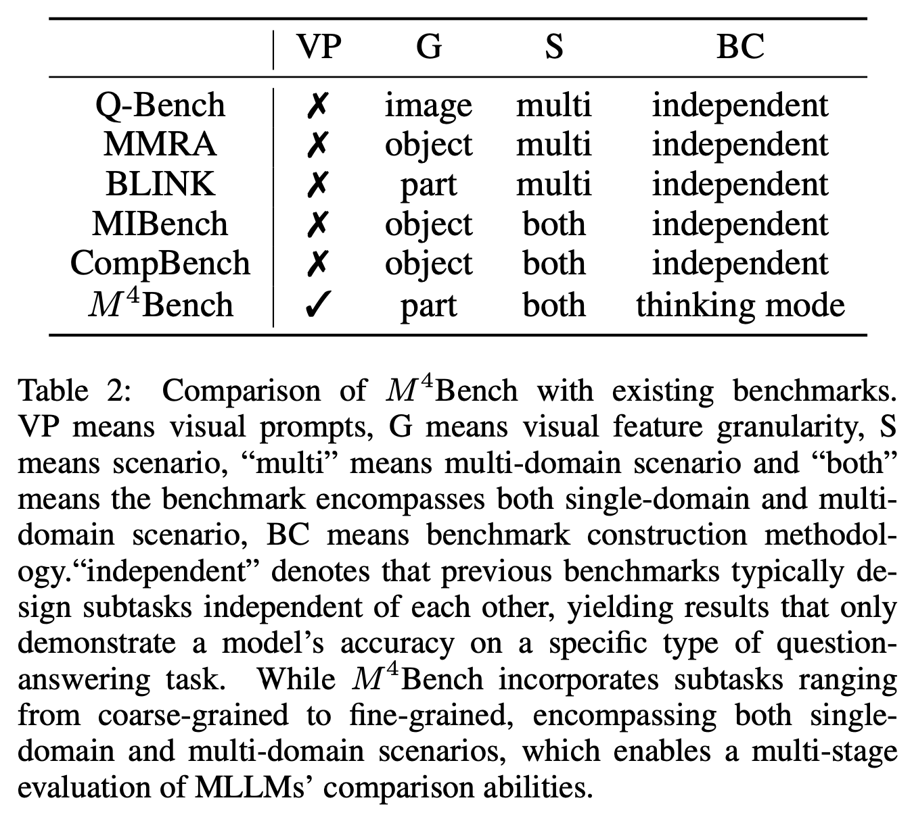
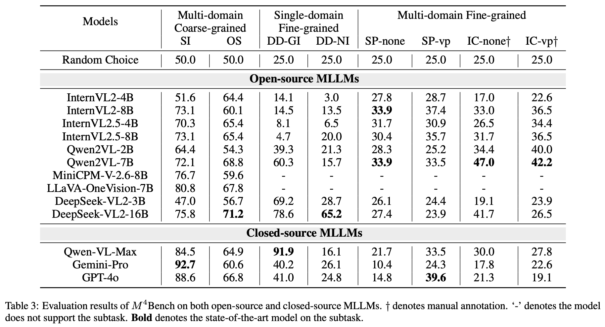
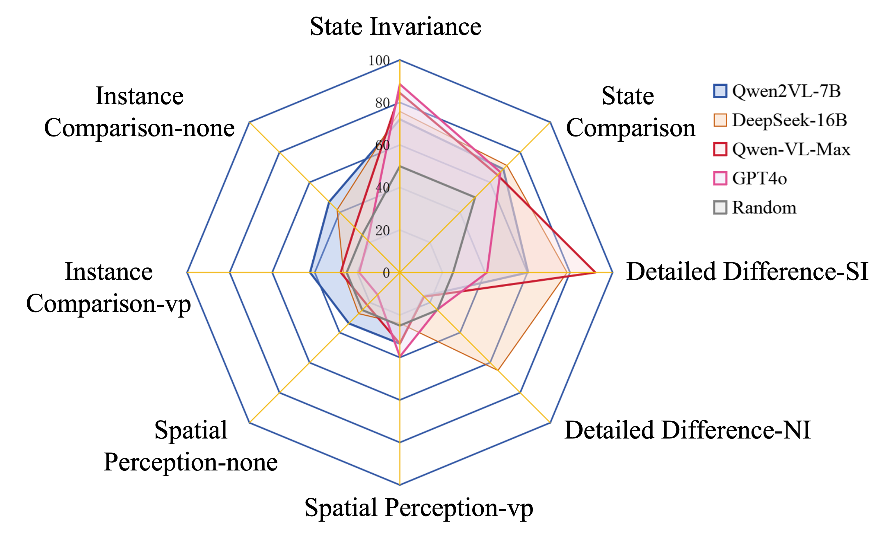

# M4Bench
[](https://huggingface.co/datasets/Anonymous8976/M4Bench) 


## Introduction
The increasing demands in analyzing complex associated scenes pose necessities to researching multi-image understanding abilities. 
Compared with understanding individual images, both the alignments and differences between images are essential aspects of understanding the intricate relationships for multi-image inference tasks. 
However, existing benchmarks face difficulties in addressing both of these aspects simultaneously, resulting in obstacles to modeling relationships under various granularities and domains of images. 
In this paper, we introduce a benchmark called $M^4$ Bench to enhance the capability of aligning and distinguishing multi-images with multi-domain multi-granularity comparison. 
We carefully design five comparison tasks related to coarse and fine-grained granularities in single and multiple domains of images and evaluate them on 13 state-of-the-art multi-modal large language models with various sizes. 
Besides, we analyze the evaluation results and provide several observations and viewpoints for the multi-image understanding research.


## Release Process
- [x] Dataset
  - [x] Preparing images
  - [x] Preparing question-answer pairs
- [x] Evaluation outputs
- [x] Evaluation code

## Dataset 🌟
**M4Bench**: 🤗[Hugging Face](https://huggingface.co/datasets/Anonymous8976/M4Bench)




## Setup
### Installation
> [!TIP] 
> Since different MLLMs may require different versions of `transformers` and `other dependencies`, we recommend creating **a separate virtual environment** for each model series (e.g., Qwen Series) to avoid dependency conflicts.
```bash
conda create -n m4bench python=3.10 -y
# git clone this repo
cd M4Bench
pip install -r requirements.txt
```

## Evaluation
Please refer to our [outputs](outputs) folder for more details.



## 🏆 Mini-Leaderboard
| Model                      | Test (1,901)|
|----------------------------|:-----------:|
|🏅 DeepSeek-16B             |     51.3    | 
|🥈 Qwen2VL-7B               |     46.7    |  
|🥉 Qwen-VL-Max              |     46.3    |  
| GPT-4o                     |     39.5    |  
| Qwen2VL-2B                 |     38.4    | 
| InternVL2-8B               |     37.8    | 
| InternVL2.5-8B             |     37.2    | 
| DeepSeek-3B                |     36.9    |  
| Gemini 1.5 Pro             |     36.8    | 
| InternVL2.5-4B             |     34.2    | 
| InternVL2-4B               |     28.7    |  
| LLaVA-OneVision            |     18.6    | 
| MiniCPM-V2.6-8B            |     17.0    | 
 